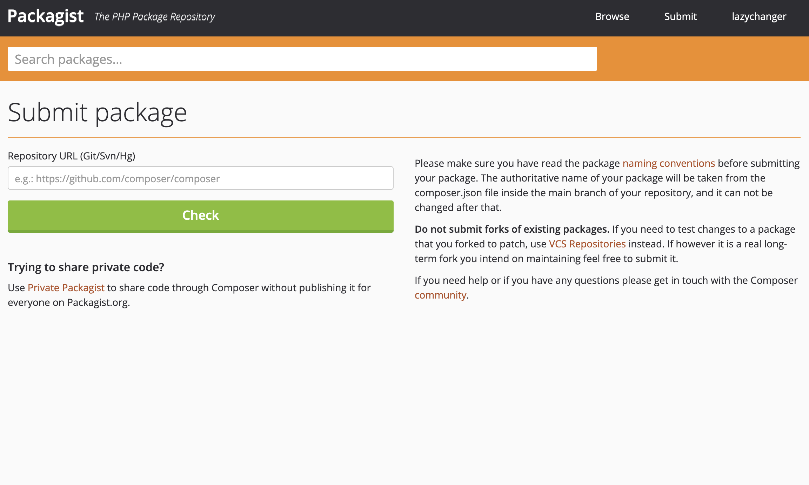
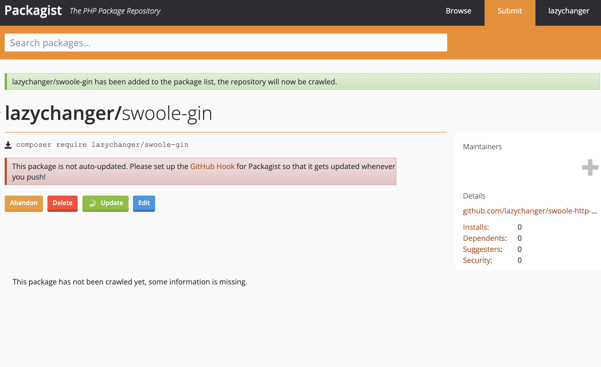

# Composer

## 介绍

    Composer 是 PHP5.3以上 的一个依赖管理工具。
    
    它允许你声明项目所依赖的代码库，它会在你的项目中为你安装他们。
    
    Composer 不是一个包管理器。是的，它涉及 "packages" 和 "libraries"，但它在每个项目的基础上进行管理，在你项目的某个目录中（例如 vendor）进行安装。

    默认情况下它不会在全局安装任何东西。因此，这仅仅是一个依赖管理。

## 使用

如今只要是新的项目，都会使用`composer`进行依赖管理。 所以我们首先要知道我们要如何充分利用`composer`，方便我们进行依赖管理，减少重复造轮子。

### [packagist](https://packagist.org/)

[packagist](https://packagist.org)是composer默认的包仓库，我们可以在这里找到绝大部分的PHP包。

### 常用命令介绍

#### init

    初始化项目，创建composer.json文件。

#### create-project

    创建一个新的项目，并且自动安装依赖。

```shell
composer create-project lazychanger/swoole-gin-framework
```

#### require

    `composer require <package>`
    它会在你的项目中安装一个包。
    如果你的项目中已经存在了这个包，那么它不会再次安装。
    如果你的项目中不存在这个包，那么它会自动安装。

```shell
composer require psr/http-message
```

#### remove

    `composer remove <package>`
    它会在你的项目中移除一个包。
    如果你的项目中不存在这个包，那么它不会移除。

```shell
composer remove psr/http-message
```

#### run-script

    `composer run-script <command>`
    它会在你的项目中执行一个脚本。
    如果你的项目中不存在这个脚本，那么它不会执行。

```composer.json
{
  // ...
  "scripts": {
    "test": "echo \"hello world\""
  }
}

```

```shell
> composer run-script test

> hello world
hello world
```

#### config

    `composer config <key> <value>`
    它会在你的项目中设置一个配置项。
    如果你的项目中不存在这个配置项，那么它不会设置。

设置仓库镜像命令

```shell
composer config repo.packagist composer https://mirrors.aliyun.com/composer/
```

执行以上命令后，你的`composer.json`中会多出内容

```composer.json
{
  // ...
  "repositories": {
    "packagist": {
      "type": "composer",
      "url": "https://mirrors.aliyun.com/composer/"
    }
  }
}
```

## 基本`Composer`项目结构

### 标准目录结构

```text
├── docs                // 文档
├── scripts             // 脚本
├── src                 // 源代码
├── tests               // 测试用例相关文件
├── vendor              // 依赖管理相关文件
├── .gitignore          // GIT忽略文件
├── phpunit.xml.dist    // PHPUnit配置文件
├── composer.json       // composer配置文件
├── LICENSE             // 许可证
└── README.md
```

## 将包发布至`packagist`

1. 访问[发布地址](https://packagist.org/packages/submit)
   
2. 输入自己的仓库地址，点击`check`按钮。成功以后`check`会变成`submit`
3. 点击Submit(提交)，即完成了包发布。
   

## 利用`composer`搭建自己的基础项目结构

### `project`与`library`区别

1. `composer.project`项目不支持`composer require`操作。 仅支持`composer create-project [package]`
2. `composer create-project [package]`执行后会在本地直接初始化整个项目仓库，而`composer require`只是下载到`vendor`目录下。
3. `composer.project`项目是基本项目，所以仓库中不需要放源码，只需要放项目的基础文件与目录结构

### `project`标准目录

```text
├── LICENSE
├── README.md
├── apps                // 应用目录，存放应用代码
├── bin                 // 入口文件
├── composer.json       
├── composer.lock
├── config              // 配置文件
└── vendor
```

### `composer.json`

```composer.json
{
  "name": "lazychanger/swoole-gin-framework",
  "type": "project",
  "license": "MIT",
  "minimum-stability": "dev",
  "authors": [
    {
      "name": "lazychanger",
      "email": "chengliang.duan@gmail.com"
    }
  ],
  "require": {
    "php": ">=8.0",
    "lazychanger/swoole-gin": "dev-main"
  }
}
```