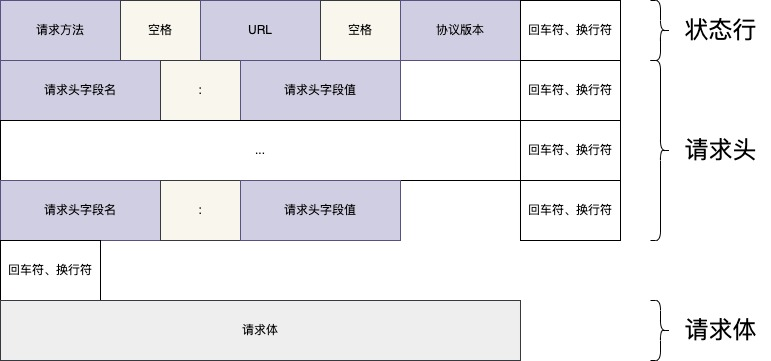
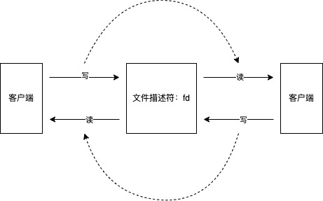

# HTTP协议

**注意：** 本文所有内容为**HTTP/1.1**介绍，不适用于**HTTP/2**；

    超文本传输协议（Hyper Text Transfer Protocol，HTTP）是一个简单的请求-响应协议，它通常运行在TCP之上。
    它指定了客户端可能发送给服务器什么样的消息以及得到什么样的响应。
    请求和响应消息的头以ASCII形式给出；
    而消息内容则具有一个类似MIME的格式。
    这个简单模型是早期Web成功的有功之臣，因为它使开发和部署非常地直截了当。

## 请求报文格式



### GET请求报文示例

```text
GET /index.html?t=1648439156 HTTP/1.1  
Accept: application/json 
Accept-Language: zh-cn  
Accept-Encoding: gzip, deflate
Content-Type: application/json
```

### POST请求报文示例

```text
POST /index.html?t=1648439156 HTTP/1.1  
Accept: application/json 
Accept-Language: zh-cn  
Accept-Encoding: gzip, deflate
Content-Type: application/json
Content-Length: 17

{"hello":"world"}
```

## 响应报文格式


### 响应报文示例

```text
HTTP/1.1 200 OK
Context-Type: application/json; charset=utf-8
Content-Length: 17
Server: Nginx
Date: Mon, 28 Mar 2022 03:41:28 GMT
Cache-Control: no-cache

{"hello":"world"}
```

## 如果基于TCP使用HTTP/1.1协议

### TCP服务

#### 概念

首先我们需要理解一点设计思想：Linux中的一切皆文件。  
所以我们对一个文件的操作，无非就两点：输入、输出；也可以理解为：读、写；

接下来就是TCP链接呢，有了解过的应该知道，TCP链接建立时候，linux内核会根据四元组（IP地址、端口号、协议类型、协议版本）来创建一个**fd**（文件描述符[^1]）。   
我们对于该**fd**（文件描述符[^1]）的读写操作，会被linux内核转为更底层的对网卡的操作；具体如下图：



在我们代码中，fd一般会被命名成 connection，表示一个链接，这样更加易读。

#### Swoole代码

```PHP
<?php

//创建Server对象，监听 127.0.0.1:9501 端口；构建TCP服务
$server = new Swoole\Server('127.0.0.1', 9501);

//监听连接进入事件
$server->on('Connect', function ($server, $fd) {
    echo "Client: Connect.\n";
});

// 监听数据接收事件；当TCP服务接收到数据时候，会触发该事件。事件会传给我们对应的fd对象；
// 在这里，swoole已经将读这一步封装好了，我们直接收到了数据；
$server->on('Receive', function ($server, $fd, $reactor_id, $data) {
    // send即为写。语义化为send，发送数据；
    $server->send($fd, "Server: {$data}");
});

//监听连接关闭事件
$server->on('Close', function ($server, $fd) {
    echo "Client: Close.\n";
});

//启动服务器
$server->start(); 

```

#### Go代码

```golang
package main

import (
	"io"
	"net"
	"time"
)

func main() {
	listener, err := net.Listen("tcp", ":8081")

	if err != nil {
		panic(err)
	}

	for {
		// 等待建立链接；阻塞；
		conn, err := listener.Accept()
		if err != nil {
			continue
		}

		// 链接建立成功，交由线程处理余下，主进程继续等待下一个链接建立
		go func() {
			// 触发事件：onConnection
			onConnection(conn)

			// 长链接，交由线程轮训读取数据；
			// 此处为了代码示意，真实业务此处看情况使用线程
			go func() {
				for {
					// 读取一次EOF（文件结束符）数据。
					// conn的数据读取是阻塞式
					data, err := io.ReadAll(conn)

					if err != io.EOF && err != nil {
						panic(err)
					}
					// 触发接受数据事件
					onReceive(conn, data)
				}
			}()

			// 30秒后关闭链接，模拟关闭
			time.Sleep(time.Second * 30)

			if onClose(conn) {
				conn.Close()
			}
		}()

	}
}

func onConnection(connection net.Conn) {

}

func onReceive(connection net.Conn, data []byte) {
	// todo 处理请求数据

}

func onClose(connection net.Conn) bool {

	return true
}
```

### 基于TCP实现HTTP协议

在上文中，我们看到了HTTP协议的请求报文格式。所以我们按照格式将请求报文解析、将响应内容构造好就行；

#### 请求报文解析
我们将数据解析为**PSR7 RequestInterface**[^2]对象；

```PHP
<?php
declare(strict_types=1);


use GuzzleHttp\Psr7\Uri;
use Psr\Http\Message\RequestInterface;
use Psr\Http\Message\StreamInterface;
use Psr\Http\Message\UriInterface;
use SwooleGin\Stream\StringStream;

class Request implements RequestInterface {
    // ...
    
    
    public static function decode(string $data): RequestInterface {
        // 首先根据请求报文的通用分隔符，切割数据
        $data = explode(self::EOL, $data);

        // 第一行是请求报文状态行。用空格分割数据单元
        // first line is protocol, look like: GET / HTTP/1.1
        // [method] [path] [protocol]
        [$method, $path, $protocol] = explode(' ', array_pop($data));

        // 中间是请求头体，格式为[key: value]。通过冒号切割就可以。
        // header is key-values array, look like: Host: test.com
        $header = [];

        while (true) {
            $line = array_pop($data);

            // 请求头体结束是以一个空行结束的。
            if (empty($line) || empty(trim($line))) {
                break;
            }
            [$key, $value] = explode(':', $line);

            // the header value will split ';' and trim space
            $header[strtolower($key)] = array_map(function ($item) {
                return !empty($item) ? $item : trim($item);
            }, explode(';', $value));
        }

        $stream = null;
        
        // 最后是请求体。请求头体结束以后，剩下如果还有数据，那就是请求体呢；
        if (!empty($data)) {
            $stream = new StringStream($data[0]);
        }
        
        return new self($method, $path, explode('/', $protocol)[1], $header, $stream);
    }

}

```
#### 响应体构造
响应体我们以**PSR7 ResponseInterface**[^3]对象构造使用；

```PHP
<?php
declare(strict_types=1);

use Psr\Http\Message\ResponseInterface;
use Swoole\Server as SwooleServer;

class ResponseWriter
{
    public static function write(SwooleServer $server, int $fd, ResponseInterface $response)
    {
        // @see https://developer.mozilla.org/zh-CN/docs/Web/HTTP/Session
        // response first line is state line.
        // [protocol] [statusCode] [getReasonPhrase]
        // 按照响应体报文格式组装好第一行
        $server->send($fd, sprintf(
                "HTTP/%s %d %s \r\n",
                $response->getProtocolVersion(),
                $response->getStatusCode(),
                $response->getReasonPhrase(),
            )
        );

        // 添加响应头
        // second is response header
        foreach ($response->getHeaders() as $key => $headers) {
            $server->send($fd, sprintf("%s: %s\r\n", ucfirst($key), implode('; ', $headers)));
        }

        // 添加响应体，如果存在响应体内容
        // if response has body
        if ($response->getBody()->getSize() > 0) {
            $server->send($fd, sprintf("Content-Size: %d\r\n", $response->getBody()->getSize()));

            // 用空格行分割出响应头和响应体
            $server->send($fd, "\r\n");
            $server->send($fd, $response->getBody()->getContents());
            // 以空行结束
            $server->send($fd, "\r\n");
        }

    }
}
```


## 仓库代码

- [Server.php](../src/Server.php)：
    - 用于初始化基础配置；
    - 启动TCP服务；
    - 隐藏HTTP协议的实现；将协议的编码、解码与业务分割；
- [Request.php](../src/Request.php)：
    - 解析HTTP请求报文；
    - 将请求报文转化为 [PSR-7](https://learnku.com/docs/psr/psr-7-http-message/1616#312ed4) 标准对象；
- [Response.php](../src/Response.php)：
    - 封装 [PSR-7](https://learnku.com/docs/psr/psr-7-http-message/1616#9da5c4) 标准对象;
- [ResponseWriter.php](../src/ResponseWriter.php)
    - 将 [PSR-7](https://learnku.com/docs/psr/psr-7-http-message/1616#9da5c4) 标准对象转化成响应报文；

## 相关资源

- [HTTP协议](http://www.w3.org/Protocols/rfc2616/rfc2616.html)
- [HTTP概述](https://developer.mozilla.org/zh-CN/docs/Web/HTTP/Overview)
- [HTTP报文](https://www.cnblogs.com/biyeymyhjob/archive/2012/07/28/2612910.html)
- [Swoole TCP Server](https://wiki.swoole.com/#/start/start_tcp_server)

[^1]: [file descriptor：文件描述符](https://baike.baidu.com/item/%E6%96%87%E4%BB%B6%E6%8F%8F%E8%BF%B0%E7%AC%A6/9809582?fr=aladdin)   
[^2]: [PSR-7 RequestInterface](https://learnku.com/docs/psr/psr-7-http-message/1616#312ed4)   
[^3]: [PSR-7 ResponseInterface](https://learnku.com/docs/psr/psr-7-http-message/1616#9da5c4)    