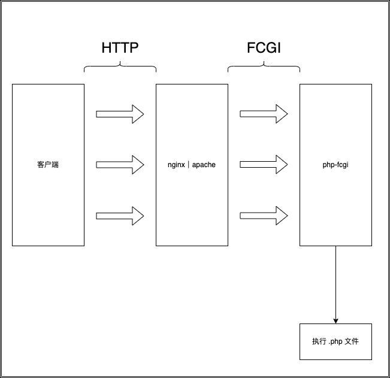
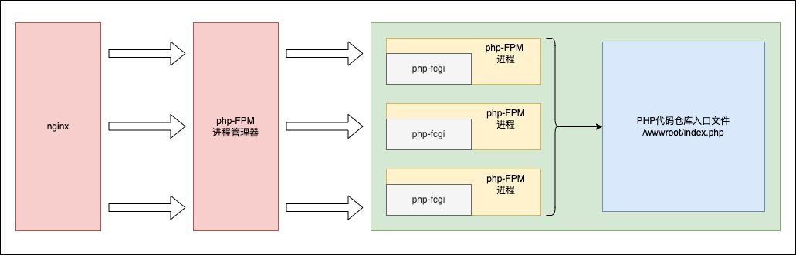
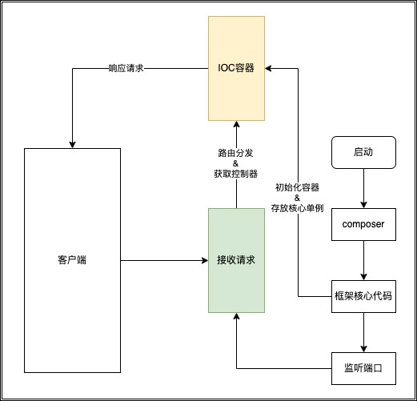

# 传统模式与常驻内存模式的区别

## 传统模式
传统模式中，我们一般会使用两种部署PHP应用的方式：第一种是 lamp；第二种是 lnmp;
这两种方式的运行逻辑原理是一致的，通过`apache|nginx`作为网络入口，再将网络请求转发到`php-fcgi`[^3]进行处理，最终`php-fcgi`[^3]会将请求解析到对应的`php`脚本进行执行；

整个过程如下图：

可以看到在整个过程中，每次网络请求都是让`php-fcgi`[^3]执行一次`php`文件。

转换到我们传统的`PHP`框架，则会以路由重写配置让每一次`php-cfgi`[^3]每次都去带参数执行入口文件。入口文件名称一般都是`index.php`；

在`nginx`中，`php-fcgi`[^3]是由`php-fpm`进行管理的。所以接下来我们直接以`php-fpm`的调度逻辑为参考。整个过程如以下图：

一定要注意一点，`php-fcgi`[^3]是执行`php`文件，而不是`php`文件已经启动，将数据传入；

所以我们每一次请求对于我们来说都是完全分割开的两次请求，每一次请求都会执行以下步骤：
1. 执行`index.php`
2. 加载`composer`的`autoload.php`
3. 加载框架的自动加载文件
4. 启动框架的核心文件
5. 解析路由
6. 实例化对应控制器
7. 执行业务代码
8. 输出响应

整个过程是非常长的，这也就是被人吐槽`慢`的原因。

## 常驻内存模式
常驻内存模式的PHP框架目前有很多，目前常见的是两种：`swoole`[^3]、`workman`[^4]。区别在于`swoole`[^3]是`c++`编写的拓展，`workman`[^4]是`php`纯原生开发的服务；

我们接下来以本仓库使用的`swoole`[^3]为例；

`swoole`的启动方式是直接监听服务端口并常驻内存，等待该端口的网络请求进入；

在启动过程中无论是框架代码还是我们的业务代码，都会用`IoC容器`[^6]的形式加载内存中，后续的所有请求都会直接处理。`IoC容器`中已经初始化的不会再重新初始化。

网络请求过程如下；

由于是常驻内存，对关键性对象只会初始化一次。所有请求直接由业务代码处理，请求处理步骤如下：
1. 路由分发
2. `IoC`容器获取对象，对象不存在则初始化
3. 执行业务代码
4. 输出响应

大大节省从请求进入到响应的过程

[^1]: [lamp指linux+apache+mysql+php的部署方式](https://baike.baidu.com/item/lamp/66952)  
[^2]: [lnmp指linux+nginx+mysql+php的部署方式](https://baike.baidu.com/item/lnmp)  
[^3]: [php-fcgi全称为php-fastCGI，php-fpm就是FastCGI进程管理器](https://www.php.net/manual/zh/install.fpm.php)
[^4]: [swoole是一个使用`C++`语言编写的基于异步事件驱动和协程的并行网络通信引擎，为`PHP`提供协程、高性能网络编程支持。提供了多种通信协议的网络服务器和客户端模块，可以方便快速的实现`TCP/UDP`服务、高性能`Web`、`WebSocket`服务、物联网、实时通讯、游戏、微服务等，使`PHP`不再局限于传统的`Web`领域。](https://wiki.swoole.com/#/)
[^5]: [Workman是一款开源高性能PHP应用容器，它大大突破了传统PHP应用范围，被广泛的用于互联网、即时通讯、APP开发、硬件通讯、智能家居、物联网等领域的开发。](https://www.workerman.net/)
[^6]: [IoC容器](https://learnku.com/articles/789/laravel-learning-notes-the-magic-of-the-service-container)